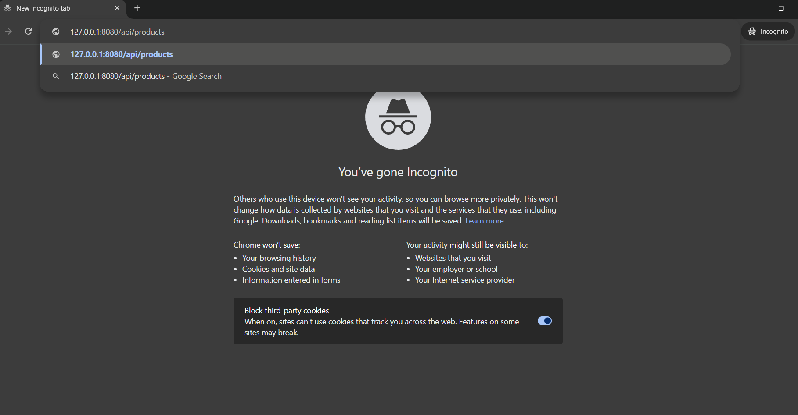
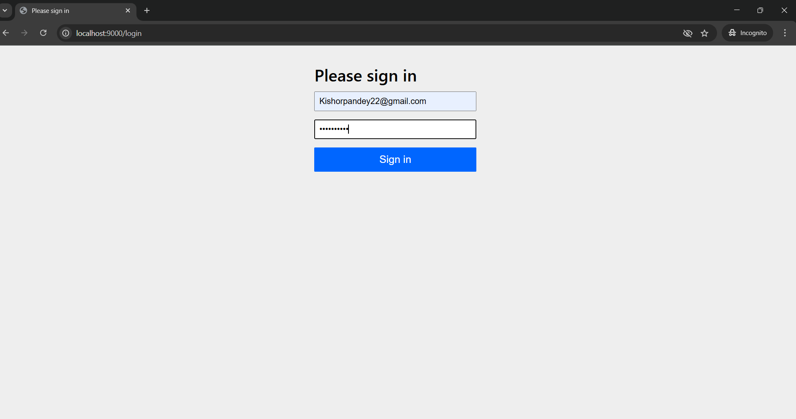
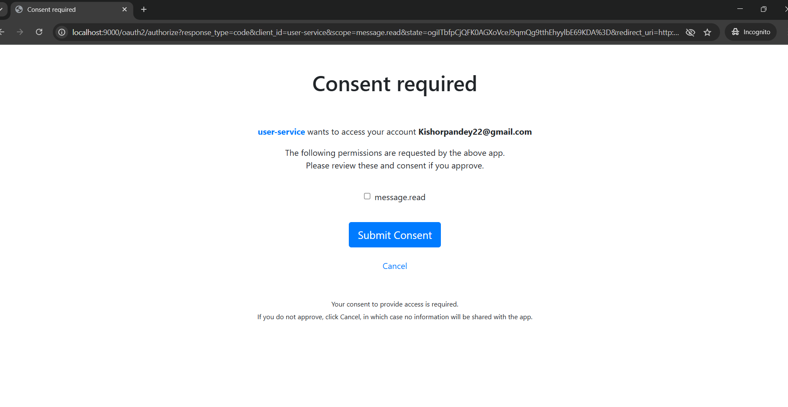
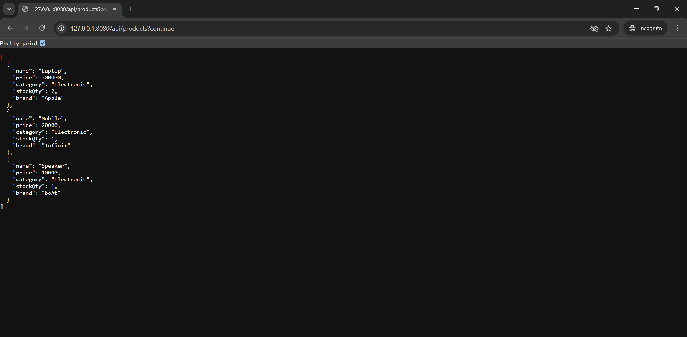
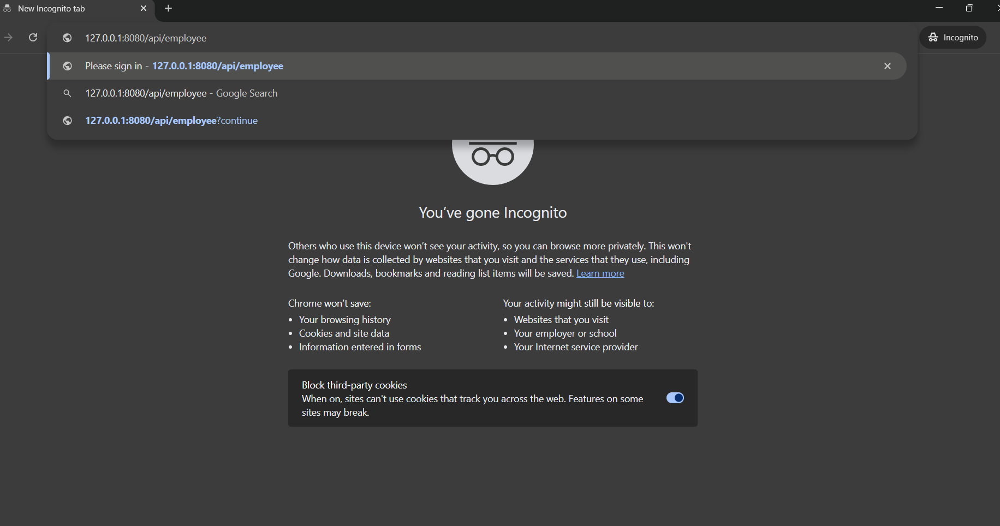
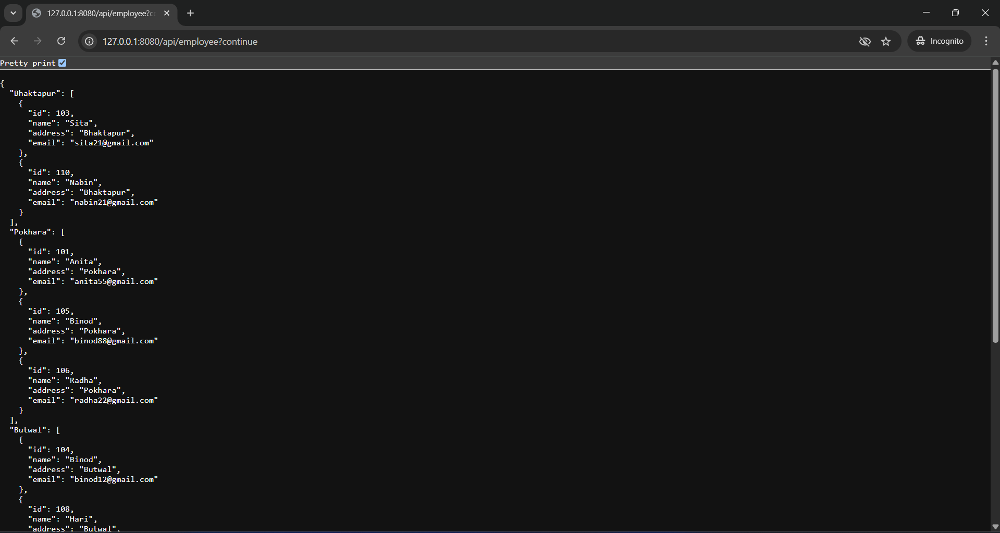

# spring-security-oauth

This project demonstrates the implementation of OAuth 2.0 authentication and authorization using Spring Security and Spring Boot. It includes three modules:

1. **Authorization Server** (`localhost:9000`) – Handles OAuth 2.0 authorization and token generation.
2. **Resource Server** (localhost`:8090`) – Secures APIs and exposes user/product endpoints.
3. **Spring Security Client** (`127.0.0.1:8080`) – Uses WebClient to securely access the Resource Server using OAuth2 tokens.

---

## Modules

### 1. Authorization Server (`localhost:9000`)

- Handles OAuth 2 login and authorization code flow.
- Issues access and refresh tokens.
- Configured clients:
  - `user-service`
  - `user-service-authorization-code`

### 2. Resource Server (`localhost:8090`)

- Secured using JWT tokens.
- Exposes REST endpoints:
  - `GET /api/users`
  - `GET /api/products`
  - `GET /api/product/{id}`
- Includes:
  - `Product` model
  - Repository layer using Spring Data JPA
  - Service and Controller

### 3. Spring Security Client (`127.0.0.1:8080`)

- Uses `OAuth2AuthorizedClientManager` and WebClient for secure calls.
- Endpoints:
  - `GET /users` → fetches `/api/users` from resource server
  - `GET /products` → fetches `/api/products`
  - `GET /product/{id}` → fetches `/api/product/{id}`

---

## OAuth2 Flow

1. User opens `127.0.0.1:8080` and initiates login.
2. Redirects to `localhost:9000/oauth2/authorize`.
3. After successful login, user is redirected back with an authorization code.
4. Client exchanges it for an access token.
5. Client uses the token to call resource server endpoints.

---

## Key Features

- OAuth2 Authorization Code Flow
- Access & Refresh Token Support
- WebClient Integration with token propagation
- Role-based and scope-based access
- Custom user domain model and repository integration

---

## Technology Stack

- Java JDK 21
- Spring Boot
- Spring Security OAuth2
- Maven
- WebClient (OAuth2 support)

---

## Client Registrations

Two clients are configured:

- `user-service` → for `openid` scope (used for login)
- `user-service-authorization-code` → for `message.read` scope (used to fetch data from resource server and within client )

---

## Useful Endpoints

### Spring Security Client (`127.0.0.1:8080`)

- `/users` → GET → calls `/api/users`
- `/products` → GET → calls `/api/products`
- `/product/{id}` → GET → calls `/api/product/{id}`
- `/api/hello` → returns a message within the client app
- `/api/employee` → another internal secured endpoint

### Authorization Server (`localhost:9000`)

- `/oauth2/authorize`
- `/oauth2/token`

### Resource Server (`localhost:8090`)

- `/api/users` → secured
- `/api/products` → secured
- `/api/product/{id}` → secured

---

## URLs

Here are a few resources I used to study OAuth2 with Spring Boot:

- [Baeldung OAuth2 Guide](https://www.baeldung.com/spring-security-oauth-resource-server)
- [Spring Docs - OAuth2](https://docs.spring.io/spring-security/reference/servlet/oauth2/client/authorized-clients.html)
- [Spring Docs](https://docs.spring.io/spring-authorization-  server/reference/getting-started.html)
- [Oauth2](https://docs.spring.io/spring-security/reference/servlet/oauth2/client/index.html
)

---

## Screenshots

 `images/` folder:
### Browser 

### Login Page

### Consent Required

### Post Login (Client Landing)

### Employee Get Request

### Get All Employees

(images/get all employee 1.png)

---

## Clone the repo
git clone https://github.com/Thekishor/spring-security-oauth.git
cd spring-security-oauth

